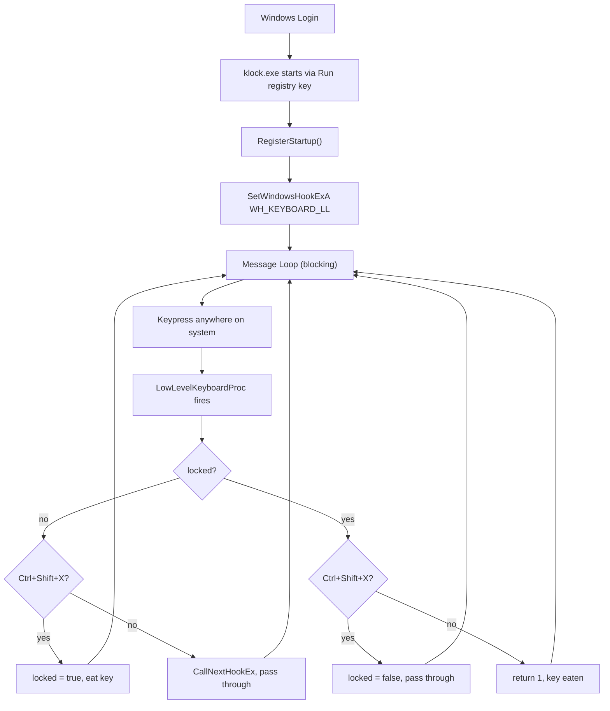

<h1 align="center">keyboard_locker: A tiny keyboard locker written in C++</h1>

This is my personal project that took ~42 mins to write. Essentially it is just a keyboard locker. Nothing really complex. 
I chose C++ for this project, because, it has easy windows API to interact and efficient binary sizes.
I've included the architecture I used to develop this below.

